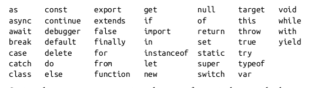

# 1 Introduction to JavaScript

Notebook for chapter 1 and 2 of [JavaScript: The Definitive Guide: Master the World's Most-Used Programming Language, 7th Edition](https://www.oreilly.com/library/view/javascript-the-definitive/9781491952016/).


```javascript
console.log("hello world!");
```
```bash
## hello world!
```

* Running js:
  1. *In the web-browser*: in the console of the developer tab of your browser;
  2. *Locally*: you can run js locally using [Node.js](https://nodejs.org/en/). After installing it, you can open it in the terminal by calling `node`. This will open an interactive js session.

There two main ways of running js scripts.

1. We can run them locally using node.js. The code below shows how:


```shellscript
node test_running_js_from_node.js
```
```bash
## hello world!
```

2. To run a script in the browser, just insert it in `<script>` html element with the path to the script as a value to the `src` attribute. E.g.


```html
<script src="test_running_js_from_node.js"></script>
```
```bash
## <script src="test_running_js_from_node.js"></script>
```

# 2 Lexical Structure

Main features:
* js is case-sensitive;
* contrary to other programming languages such as python, js ignores the space and line breaks between tokens in its programs;

## Comments

JavaScripts supports two types of comments


```javascript
let a = 1 //this is a comment
let b = 2 /* this is another commenct, though it can be .......................
..............................................................................
multi-line */
let c = a + b
console.log(c)
```
```bash
## 3
```

## Literals

A *literal* is a data value that appears directly in a program. The following are all literals.


```javascript
12 //The number twelve
1.2 //the number one point two
"hello world" // a string
'Hi' // another string
true // a boolean value
false // another boolean value
null // absence of an object
```
```bash
## null
```

## Identifiers and Reserved Words

An *identifier* is simply a name, in js these are used to name:
* constants
* variables
* properties
* functions
* classes

In js an identifiers must start with a letter, an underscore (`_`), or a dollar sign (`$`). Subsequent characters can be letters, digits, underscores, or dollar signs.

### Reserved Words

The following words are part of JavaScript language and as such should not be used as identifiers.



## Unicode

JavaScript programs are writte using the Unicode character set, and you can use any Unicode characters in strings and comments. This means that programmers can use mathematical symbols and words from non-English languages as constants and variables:


```javascript
const π = 3.14;
const sí = true;
const ザ = "zá";

console.log(sí)
console.log(π)
console.log(ザ)
```
```bash
## true
## 3.14
## zá
```

Some computer hardware and software cannot display the full set of Unicode characters. For dealing with these situations, js defines escape sequences that allow users to write Unicode characters using only ASCII characters.


```javascript
console.log("café"); // Define a variable using a Unicode character
console.log("caf\u00e9") // => 1; access the variable using an escape sequence
console.log("caf\u{E9}") // => 1; another form of the same escape sequence
```
```bash
## café
## café
## café
```

## Optional Semicolons

Like other programming languages such sql, js uses the semicolon (`;`) to separate statements. However, the semicolon is optional if statements are separated by lines.


```javascript
/* this is ok*/
a = 3
b = 4
c = a + b
```
```bash
## 7
```


```javascript
/* this is ok */
a = 3; b = 4; c = a + b;
```
```bash
## 7
```


```javascript
/* this is not */
a = 3 b = 4 c = a + b
```
```bash
## 7
```

JavaScript does not treat every line break as a semicolon, it usually treats line breaks as semicolons only if it can't parse the code without adding an implicit semicolong. Putting it differently, JavaScript treats a line break as a semicolon if the next nonspace character cannot be interpreted as a continuation of the current statement.

E.g. because `=` is interpreted as a continuation of a, it is not treated as a semicolon. 


```javascript
let a
a
=
3
console.log(a)
```
```bash
## 3
```