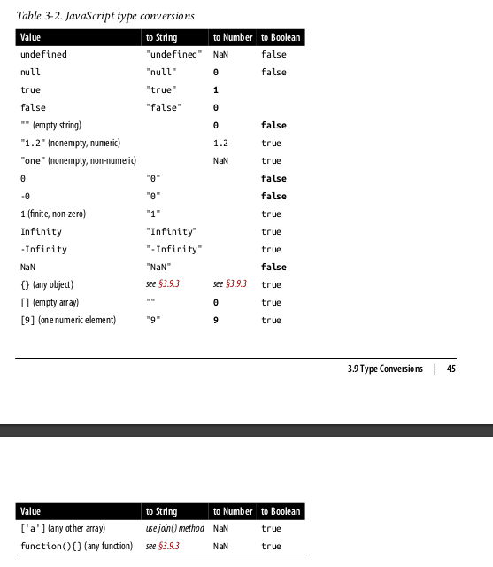

# 3 Types, Values, and Variables

Notebook for chapter 3 of [JavaScript: The Definitive Guide: Master the World's Most-Used Programming Language, 7th Edition](https://www.oreilly.com/library/view/javascript-the-definitive/9781491952016/).

JavaScript types can be divided into two categories: *primitive types* and *object types*. JavaScript's primitive types are composed by:
* text
* number
* boolean
* symbol
* `null`
* `undefined`

Any type which is not one of the described above is defined as *type object* or an `object`. An `object` is a collection of `properties`, where each property as a name and a value (either a primitive value or another object).

An ordinary object is an *unordered collection of named values*. However, there are special types of object which differ from these standard objects, such as:
* An `array` is an *ordered collection of numbered values*


```javascript
const fruits = ['Maçã', 'Banana'];

console.log(fruits);
```
```bash
## [ 'Maçã', 'Banana' ]
```

* A `Set` object represents a set of **unique** values


```javascript
const my_set1 = new Set()

my_set1.add(1)           // Set [ 1 ]
my_set1.add(5)           // Set [ 1, 5 ]
my_set1.add(5)           // Set [ 1, 5 ]
my_set1.add('some text') // Set [ 1, 5, 'some text' ]

console.log(my_set1)
```
```bash
## Set(3) { 1, 5, 'some text' }
```

* A `Map` object represents mapping keys to values (fairly similar, at least in usage, to Python's dictionaries)


```typescript
// this is a map
const fruits2 = new Map([
    ["apples", 500],
    ["bananas", 300],
    ["oranges", 200]
  ]);

  console.log(fruits2)
```
```bash
## Map(3) { 'apples' => 500, 'bananas' => 300, 'oranges' => 200 }
```

Among other...

## Numbers

`Number`, a primitive js numeric type, is used to represent integers and to approximate real numbers.

### Integer Literals

In a JavaScript program, a base-10 integer is written as a sequence of digits. For example:


```typescript
0
3
10000000
```
```bash
## 10000000
```

In addition to base-10 integer literals, JavaScript recognizes hexadecimal (base-16) values. A hexadecimal literal begins with `0x` or `0X`, followed by a string of hexadecimal digits. A hexadecimal digit is one of the digits 0 through 9 or the letters a (or A)
through f (or F), which represent values 10 through 15. Here are examples of hexadecimal integer literals:


```typescript
let a = 0xff// => 255: (15*16 + 15)
console.log(a)
let b = 0xBADCAFE // => 195939070
console.log(b)
```
```bash
## 255
## 195939070
```

### Floating-Point Literals

Floating-point literals can have a decimal point; they use the traditional syntax for real numbers. A real value is represented as the integral part of the number, followed by a decimal point and the fractional part of the number.


```typescript
3.14
2345.6789
.333333333333333333
6.02e23 // 6.02 × 10²³
1.4738223E-32 // 1.4738223 × 10 ⁻ ³²
```
```bash
## 1.4738223e-32
```

### Arithmetic in JavaScript

JavaScript programs work with numbers using the arithmetic operators . that the language provides. These include + for addition, - for subtraction, * for multiplication, / for division, and % for modulo (remainder after division). ES2016 adds ** for exponentiation. Full details on these and other operators can be found in Chapter 4.


```typescript
console.log(Math.pow(2,53));// => 9007199254740992: 2 to the power 53
console.log(Math.round(.6)); // => 1.0: round to the nearest integer
console.log(Math.ceil(.6)); // => 1.0: round up to an integer
console.log(Math.floor(.6)); // => 0.0: round down to an integer
console.log(Math.abs(-5)); // => 5: absolute value
console.log(Math.max(1,2,3)); // Return the largest argument
console.log(Math.min(1,2,3)); // Return the smallest argument
console.log(Math.random()); // Pseudo-random number x where 0 <= x < 1.0
console.log(Math.PI); // π: circumference of a circle / diameter
console.log(Math.E); // e: The base of the natural logarithm
console.log(Math.sqrt(3)); // => 3**0.5: the square root of 3
console.log(Math.pow(3, 1/3)); // => 3**(1/3): the cube root of 3
console.log(Math.sin(0)); // Trigonometry: also Math.cos, Math.atan, etc.
console.log(Math.log(10)); // Natural logarithm of 10
console.log(Math.log(100)/Math.LN10); // Base 10 logarithm of 100
console.log(Math.cbrt(27)); // => 3: cube root
console.log(Math.hypot(3, 4)); // => 5: square root of sum of squares of all arguments
console.log(Math.log10(100)); // ()=> 2: Base-10 logarithm
console.log(Math.log2(1024));// => 10: Base-2 logarithm
console.log(Math.imul(2,3)); // => 6: optimized multiplication of 32-bit integers
console.log(Math.clz32(0xf)); // => 28: number of leading zero bits in a 32-bit integer
console.log(Math.trunc(3.9)); // => 3: convert to an integer by truncating fractional part
```
```bash
## 9007199254740992
## 3
```

Arithmetic in JavaScript does not raise errors in cases of overflow, underflow, or division by zero. When the result of a numeric operation is larger than the largest representable number (overflow), the result is a special infinity value, Infinity.


```javascript
Infinity
Number.POSITIVE_INFINITY
1/0
Number.MAX_VALUE * 2
-Infinity
Number.NEGATIVE_INFINITY
-1/0
-Number.MAX_VALUE * 2
NaN
Number.NaN
0/0
Infinity/Infinity
Number.MIN_VALUE/2
-Number.MIN_VALUE/2
-1/Infinity
-0
```
```bash
## 0
```

The not-a-number value has one unusual feature in JavaScript: it does not compare equal to any other value, including itself. This means that you can’t write `x === NaN` to determine whether the value of a variable x is NaN. Instead, you must write `x != x`
or `Number.isNaN(x)`. Those expressions will be true if, and only if, x has the same value as the global constant NaN.


```javascript
x = NaN

test_1 = x == NaN

test_2 = Number.isNaN(x)


console.log(test_1)
console.log(test_2)
```
```bash
## false
## true
```

Related to this, the function `Number.isFinite()` evaluates if an argument is a `Number` other than `NaN`, `Infinity`, or `-Infinity`


```javascript
a = 1011
b = Infinity
c = NaN

console.log(Number.isFinite(a))
console.log(Number.isFinite(b))
console.log(Number.isFinite(c))
```
```bash
## true
## false
## false
```

### Arbitrary Precision Integers with BigInt

As the name implies, BigInt is a numeric type whose values are integers. The type was added to JavaScript mainly to allow the representation of 64-bit integers, which are required for compati‐
bility with many other programming languages and APIs. But BigInt values can have thousands or even millions of digits, should you have need to work with numbers that large. You can use BigInt() as a function for converting regular JavaScript numbers or
strings to BigInt values:


```javascript
largest_number_allowed = Number.MAX_SAFE_INTEGER

even_larger = Math.pow(largest_number_allowed, 2)

console.log(even_larger)

as_big_int = BigInt(even_larger)

console.log(as_big_int)
```
```bash
## 8.112963841460666e+31
## 81129638414606663681390495662080n
```

### Dates and Times

JavaScript defines a simple Date class for representing and manipulating the numbers that represent dates and times. JavaScript Dates are objects, but they also have a numeric representation as a timestamp that specifies the number of elapsed milliseconds since January 1, 1970:


```javascript
let timestamp = Date.now() // today's date as timestamp
console.log(timestamp)
let now = Date() // today's date as a Date object
console.log(now)
```
```bash
## 1651926093028
## Sat May 07 2022 13:21:33 GMT+0100 (Western European Summer Time)
```

The date methods will be covered in more detail later on. 

## Text

The JavaScript type for representing text is the *string*. A string is an immutable ordered sequence of 16-bit values, each of which typically representas a Unicode character. The *length* of a string is the number of 16-bit values it contains. JavaScript’s
strings (and its arrays) use zero-based indexing: the first 16-bit value is at position 0, the second at position 1, and so on. The empty string is the string of length 0. JavaScript does not have a special type that represents a single element of a string.

### String Literals

To include a string in a JavaScript program, simply enclose the characters of the string within a matched pair of single or double quotes or backticks ( ' or " or ` ). Double-quote characters and backticks may be contained within strings delimited by single-quote characters, and similarly for strings delimited by double quotes and backticks.

The original versions of JavaScript required string literals to be written on a single line, and it is common to see JavaScript code that creates long strings by concatenating single-line strings with the + operator. As of ES5, however, you can break a string literal across multiple lines by ending each line but the last with a backslash ( \ ).


```javascript
a_text = "Hello"
another_text = "World!"

console.log(a_text + another_text)
console.log(a_text + " " +  another_text)
console.log(a_text + "\n" +  another_text)
console.log(a_text  +  another_text)
```
```bash
## HelloWorld!
## Hello World!
## Hello
## World!
## HelloWorld!
```

The backslash character ( \ ) has a special purpose in JavaScript strings. Combined with the character that follows it, it represents a character that is not otherwise representable within the string. For example, \n is an escape sequence that represents a newline character.


```javascript
console.log('You can\'t do that!')
```
```bash
## You can't do that!
```

To determine the length of a string we can use the `.length` property of the string. 


```javascript
let a_text = "This is a sentence."

console.log("Current sentence has " + a_text.length + " characters")
```
```bash
## Current sentence has 19 characters
```

In addition, the JavaScript provides a rich api for working with strings.


```javascript
console.log(a_text.substring(1,4)); // the 2nd, 3rd, and 4th characters
console.log(a_text.slice(1,4)); // idem, but different function
console.log(a_text.split(" ")); // split the string 
/* searching for a substring */
console.log(a_text.indexOf("This")); // position of first character of the substring
console.log(a_text.startsWith("This")); // => true: string starts with this substring
console.log(a_text.endsWith("sentence.")); // => true: string ends with this substring
console.log(a_text.includes("a")); // => true: string includes this substring
/* creating modified versions of a string */
console.log(a_text.replace("is ", "is not ")); // replace the first sub-string with the second
console.log(a_text.toLowerCase()); // to lower case
console.log(a_text.toUpperCase()); // to upper case
console.log("\u006E\u0303o".normalize()); // => ño: normalize to unicocde
/* String padding functions in ES2017 */
console.log("x".padStart(3)); // => " x": add
console.log("x".padEnd(3)); // => "x ": add
console.log("x".padStart(3, "*")); // => "**x": add
console.log("x".padEnd(3, "-")); // => "x--": add
/* white space trimming */ 
x = "        Hello world!            ";
console.log(x.trim());
console.log(x.trimStart());
console.log(x.trimEnd());
```
```bash
## his
##   x
## x  
## **x
## x--
## Hello world!
## Hello world!            
##         Hello world!
```

As discussed above, strings are nothing but arrays composed with 16-bit characters. Consequently, they may be index link arrays.


```javascript
a_text[0] + a_text[1] + a_text[2] + a_text[3];
```
```bash
## 'This'
```


```javascript
// with a for loop
new_text = ""
max_char = 4
for (let i = 0; i <= max_char; i++) {
    new_text += a_text[i]
}
console.log(new_text)
```
```bash
## This 
```

### Template Literals

In ES6, string literals can be delimited with  backtics "`".


```javascript
console.log(`This is a string with backticks`)
```
```bash
## This is a string with backticks
```

This matters because strings with these delimiters allow for interpolation, namely the final value of a string literal
in backticks is computed by evaluating any included expressions, converting the values of those expressions to strings and combining those computed strings with the literal characters within the backticks.


```javascript
let cur_name = "Bill";
let greeting_not_work = "Hello ${ cur_name }. "// Hello Bill
let greeting_works = `Hello ${ cur_name }. `// Hello Bill
console.log(greeting_not_work)
console.log(greeting_works)
```
```bash
## Hello ${ cur_name }. 
## Hello Bill. 
```

Everything within the `{ ... }` will be evaluated as a javascript expression, interpreted, and converted into a string.


```javascript
let cur_name = Math.PI
let greeting_works = `Hello ${ cur_name }. `
console.log(greeting_works)
```
```bash
## Hello 3.141592653589793. 
```

#### Tagged template literals

Tags are functions that perform custom parsing of a template literal. It is just like template literals, however we pass the "tag" to the beggining of the string and it will perform the operation on the entire string.


```javascript
function romanize (num) {
    // from: https://stackoverflow.com/questions/9083037/convert-a-number-into-a-roman-numeral-in-javascript
    if (isNaN(num))
        return NaN;
    var digits = String(+num).split(""),
        key = ["","C","CC","CCC","CD","D","DC","DCC","DCCC","CM",
               "","X","XX","XXX","XL","L","LX","LXX","LXXX","XC",
               "","I","II","III","IV","V","VI","VII","VIII","IX"],
        roman = "",
        i = 3;
    while (i--)
        roman = (key[+digits.pop() + (i * 10)] || "") + roman;
    return Array(+digits.join("") + 1).join("M") + roman;
}

function romeNumerize(strings, num){
    return strings[0] + romanize(num) + strings[1];
}

console.log(romeNumerize`I have ${ 2 } cats.`)
console.log(romeNumerize`I have ${ 2 } cats. But my neighbour has ${ 4 }`)
```
```bash
## I have II cats.
## I have II cats. But my neighbour has 
```

The second function did not work, that is because tagged literals are treated like arrays of strings where the the `${}` is the delimiter spliting the string. Since we only index the strings in position 0 and 1, we are only taking into consideration the first delimiter. To make it scalable to more.


```javascript
function romeNumerizeEverything(strings, ...num) {
    let newStr = '';

    for (let i = 0; i < strings.length; i++) {

        console.log(` [+] In position ${i} in the strings array we have string: ${strings[i]}`)
        // because the first string can never be a delimiter
        if (i > 0) {
            // fetch the number and subtract the index of its position so we get the next
            console.log(` [!] In position ${i - 1} in the num array we have value: ${num[i - 1]}`)
            newStr += romanize(num[i - 1]);
        }
        // add the string
        newStr += strings[i]
    }
    return newStr;
}
```


```javascript
console.log(romeNumerizeEverything`I have ${ 2 } cats.`)
```
```bash
##  [+] In position 0 in the strings array we have string: I have 
##  [+] In position 1 in the strings array we have string:  cats.
##  [!] In position 0 in the num array we have value: 2
## I have II cats.
```


```javascript

console.log(romeNumerizeEverything`I have ${ 2 } cats. But my neighbour has ${ 4 }`)
```
```bash
##  [+] In position 0 in the strings array we have string: I have 
##  [+] In position 1 in the strings array we have string:  cats. But my neighbour has 
##  [!] In position 0 in the num array we have value: 2
##  [+] In position 2 in the strings array we have string: 
##  [!] In position 1 in the num array we have value: 4
## I have II cats. But my neighbour has IV
```


```javascript

console.log(romeNumerizeEverything`I have ${ 2 } cats. But my neighbour has ${ 4 } cats. His neighbour, however, has something like ${ 12 } cats.`)
```
```bash
##  [+] In position 0 in the strings array we have string: I have 
##  [+] In position 1 in the strings array we have string:  cats. But my neighbour has 
##  [!] In position 0 in the num array we have value: 2
##  [+] In position 2 in the strings array we have string:  cats. His neighbour, however, has something like 
##  [!] In position 1 in the num array we have value: 4
##  [+] In position 3 in the strings array we have string:  cats.
##  [!] In position 2 in the num array we have value: 12
## I have II cats. But my neighbour has IV cats. His neighbour, however, has something like XII cats.
```


```javascript

console.log(romeNumerizeEverything`I have ${ 2 } cats. My partner has none. But my neighbour has ${ 4 } cats. His neighbour, however, has something like ${ 12 } cats.`)
```
```bash
##  [+] In position 0 in the strings array we have string: I have 
## I have II cats. My partner has none. But my neighbour has IV cats. His neighbour, however, has something like XII cats.
```

## Boolean Values

A boolean value represents truth or falsehood, on or off, yes or no. There are only two possible values of this type. The reserved words true and false evaluate to these two values. These will be covered in more detail later one...

Overall, we can use operators to generate boolean values. e.g.


```javascript
let a = null;

console.log(a === null);
console.log(a !== 2);
```
```bash
## true
## true
```

As in other programming languages, like R, we have the `&` and `|` boolean operators representing the boolean **AND**/**OR**.


```javascript
let a = "reasonably large string";

if (a.length > 3 & a.length < 500) {
    console.log("Yes, it is reasonably large")
}
```
```bash
## Yes, it is reasonably large
```

The `&&` operator evaluates a true value *if and only if* both operands are true, false otherwise.


```javascript
let a = null;

if (a !== null && (a.length > 3 & a.length < 500)) {
    console.log("Yes, it is reasonably large")
} else {
    console.log("No size at all, it is a null!")
}
```
```bash
## No size at all, it is a null!
```

The operator `||` evaluates a boolean to true if either or the operands (or all) evaluate to true.


```javascript
let a = "A";

if (a !== null || (a.length > 3 & a.length < 500)) {
    console.log("This is dangerous stuff.")
} else {
    console.log("No size at all, it is a null!")
}
```
```bash
## This is dangerous stuff.
```

## `null` and `undefined`

`null` is a language keyword that evaluates to a special value that is usually used to indicate the absence of a value. Using the typeof operator on null returns the string “object”, indicating that null can be thought of as a special object value that indicates “no object”.

The `undefined` value occurs in more specific circumstances, namely:
* values that have not been initialized
* when you query an object property that does not exist
* or in functions which do not return anything or in functions for which no arguments were passed.


```javascript
let a;
console.log(a);
```
```bash
## undefined
```


```javascript
function iShouldReturnStuff(a, b) {
    let c = a + b
}

console.log(iShouldReturnStuff(1, 3))
```
```bash
## undefined
```


```javascript
function iShouldReturnStuff(a, b) {
    let c = a + b
    return [a, b, c]
}

console.log(iShouldReturnStuff())
// note that arithmetic operations with undefined objects seem to lead to NaN
console.log(undefined + undefined)
```
```bash
## [ undefined, undefined, NaN ]
## NaN
```

## Symbols

Symbols were introduced in ES6 to serve as non-string property names. Recall that by default an `Object` is an unordered collection of properties, where each property has a name and a value. Property names are typically strings, but `Symbols` can also serve this purpose.


```javascript
// start by creating an empty Object
const simpleObject = {};
```


```javascript
// generate the string and symbol property names
let strPropertyName = "string name";
console.log(typeof(strPropertyName));
let symbolPropertyName = Symbol("symbol name");
console.log(typeof(symbolPropertyName));
```
```bash
## string
## symbol
```


```javascript
// add properties to the initialized object
simpleObject[strPropertyName] = 1;
simpleObject[symbolPropertyName] = 2;

console.log(simpleObject)
```
```bash
## { 'string name': 1, [Symbol(symbol name)]: 2 }
```

To obtain the value of the symbol you have to invoke the symbol value.


```javascript
Symbol(simpleObject[symbolPropertyName])
```
```bash
## Symbol(2)
```

This usefullness of this object type seems to be tied with iterators which will be covered much, much further down the road.

## Immutable Primitive Values and Mutable Object Rereferences

The fundamental difference between primitive values (undefined, null, booleans, numbers, and strings) and objects (e.g. arrays and functions) is that the former are immutable - i.e. there is no way of changing a primitive value. E.g.


```javascript
let s = "hello";
s.toUpperCase();
s
// Start with some lowercase text
// Returns "HELLO", but doesn't alter s
// => "hello": the original string has not changed
```
```bash
## 'hello'
```

Primitives are also compared by value. Objects, however, are mutable and cannot be compared just by value. Two arrays are not equal even if they have the same values in the same order.


```javascript
let o = { x: 1 }, p = { x: 1 };
console.log(o === p);
let a = ["fooh"], b = ["fooh"];
console.log(a === b);
```
```bash
## false
## false
```

Instead, objects are compared by references: *in js, two objects are equal if and only if they both refer to the same underlying object*.


```javascript
let a = [];
let b = a;
b[0] = 1;
console.log(a[0])
console.log(a === b)
```
```bash
## 1
## true
```

As you can see, assigning object `a`, an empty array, to `b` did not create a copy of it, but rather a reference. Now changes to `b` will also occur in `a` as it references it. If you want to create a new copy of an object, say of `a`, you must **explicitly copy its properties**, in this case, the elements of the array.


```javascript
let a = [1,2,3,4];
let b = [];
for(let i = 0; i<a.length; i++) {
    b[i] = a[i];
}
let c = Array.from(b)
console.log(c)
```
```bash
## [ 1, 2, 3, 4 ]
```

Similarly, if we want to compare two distinct objects, we must compare their elements or properties.


```javascript
function compareArray(a, b) {
    if (a === b) {
        console.log("arrays reference each other, so they are the same object");
        return true;
    } else if (a.length !== b.length) {
        console.log("the arrays have different lengths, cannot have the same elements");
        return false;
    } else {
        for (let i = 0; i < a.length; i++) {
            if (a[i] !== b[i]) {
                console.log(`Element ${a[i]} in position ${i} is different from ${b[i]} in the same position`)
                return false;
            }
        }
        console.log("the arrays have the same elements");
        return true;
    }
}
```


```javascript
let x = [];
let y = x;
compareArray(x,y)
```
```bash
## arrays reference each other, so they are the same object
```
```bash
## true
```


```javascript
let x = [];
let y = [];
compareArray(x,y)
```
```bash
## the arrays have the same elements
```
```bash
## true
```


```javascript
let x = [1, "a", "b", 2];
let y = [1, "a", "b"];
compareArray(x,y)
```
```bash
## the arrays have different lengths, cannot have the same elements
```
```bash
## false
```


```javascript
let x = [1, "a", 2, "b"];
let y = [1, "a", "b", 2];
compareArray(x, y)
```
```bash
## Element 2 in position 2 is different from b in the same position
```
```bash
## false
```

## Type conversions

JS is very flexible about the types of values it requires as it frequently tries to automatically convert types. Examples below


```javascript
console.log((10 + " strings")) // it converts the number 10 automatically to a string
console.log(("string " + 10)) 

console.log("10" * "10") // it converts to numbers


console.log((1 - "x")) // string "x" can't convert to a number

console.log((NaN + " strings")) // cant convert a NaN to a string

```
```bash
## 10 strings
## string 10
## 100
## NaN
## NaN strings
```

The table below sumarizes javascript automatic type conversions.




### Conversions and equality


